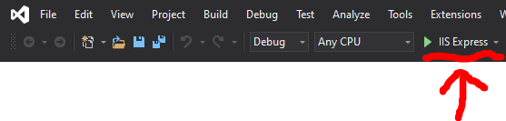

# Oracle Sample Project

A sample ASP.NET Core MVC Web Application that connects with an Oracle Database.

## Please note: This application will only work if it can connect with an Oracle Database.

### How to run the project in Visual Studio
To run the project in Visual Studio, simply:

	> 1. Download the project from this repository <br>
	> 2. Open the project in Visual Studio <br>
	> 3. Click "IIS Express"

<div align = "center">
	
</div>

### How to run the project in Visual Studio Code
To run the project in Visual Studio <strong>Code</strong>, simply:

	> 1. Download the project from this repository <br>
	> 2. Open the project in Visual Studio Code <br>
	> 3. Open up the terminal <br>
	> 4. Run the command ``` dotnet run ```